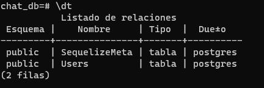

# Para iniciar un proyecto se inicia con:

## 1. SERVIDOR Y BASE DE DATOS

1. `npm init -y`

2. `npm i express sequelize pg pg-hstore dotenv cors morgan  sequelize-cli`

3. `npm i nodemon -D` - _dependencia de desarrollo_

4. crear la carpeta` src` y el archivo `app.js`

5. realizar los scripts

```js
"scripts": {
    "start": "node ./src/app.js",
    "dev": "nodemon ./src/app.js",
   }
```

6. crear el servidor y hacer las importaciones instaladas en app.js

```js
const express = require("express"); // esto es importar con cjs common java script
const morgan = require("morgan");
const cors = require("cors");
require("dotenv").config();

const PORT = process.env.PORT ?? 8000;

const app = express();

app.use(cors());
app.use(morgan("tiny"));
app.use(express.json());

app.get("/", (req, res) => {
  res.send("OK");
});

app.listen(PORT, () => {
  console.log(`servidor escuchando en el puerto ${PORT}`);
});
```

7. `npx sequelize-cli init` - _para crear las carpetas de migracion_

8. En la carpeta "config" vamos a cambiar los valores de nuestra base de datos en "development" por los valores de nuestro servidor SQL postgres

9. Mover las carpetas creadas a la carpeta "src"

10. Una vez que se movieron las carpetas se debe de modificar su ruta por defecto, esto se hace creando un archivo de configuracion en la raiz principal. `.sequelizerc`

    

11. En la carpeta "config" se utilizaran variables de entorno para eso se debe importar el "dotenv" pero como en un archivo json no se puede inportar entonces se modifica la extension a js

```js
require("dotenv").config();

module.exports = {
  development: {
    username: "postgres",
    password: "root",
    database: "chat_db",
    host: "localhost",
    dialect: "postgres",
  },
  test: {
    username: "root",
    password: null,
    database: "database_test",
    host: "127.0.0.1",
    dialect: "mysql",
  },
  production: {
    username: "root",
    password: null,
    database: "database_production",
    host: "127.0.0.1",
    dialect: "mysql",
  },
};
```

12. en el archivo `.sequelizerc`

```js
const path = require("node:path");

// esto es igual a export default
module.exports = {
  config: path.resolve("src", "config", "config.js"), // de esta manera le decimos donde esta la ruta de config para la creacion de la base de datos y asi mismo las demas carpetas que se movieron
  "models-path": path.resolve("src", "models"),
  "seeders-path": path.resolve("src", "seeders"),
  "migrations-path": path.resolve("src", "migrations"),
};

// el config no lleva comillar porque no tiene guion de lo contrario llevaria comillas como el resto
```

13. Crear la base de datos con el comando: `npx sequelize-cli db:create `

## 2. MODELOS O MIGRACIONES (atributos)

### 1. Para crear atributos con sequelize-cli se bede de poner el siguiente comando `npx sequelize-cli model:generate` seguido del nombre de la tabla mas sus atributos con los comandos `--name nombre --attributes nombreAtributo:tipodeDato` sin espaciosm los atributos

### Ejm:

`npx sequelize-cli model:generate --name User --attributes firstname:string,lastname:string,email:string,avatar:string,password:string,description:string,validEmail:boolean`

### Ejm2 Enum

`npx sequelize-cli model:generate --name Conversation --attributes title:string,conversationImage:string,"type:enum:{single,group}",createdBy:integer`

de esta madera se creara un archivo en la carpeta de `migrations` y `models`

### 2. Modificar las los modelos desde la carpeta de `migrations` agregando sus caracteristicas

### Ejm

```js
firstname: {
        type: Sequelize.STRING(50),
        allowNull: false,
      },
      lastname: {
        type: Sequelize.STRING(50),
        allowNull: false,
      },
      email: {
        type: Sequelize.STRING(50),
        unique: true,
        allowNull: false,
        validate: {
          isEmail: true,
        },
      },
      avatar: {
        type: Sequelize.STRING,
        defaultValue:
          "https://img.freepik.com/vector-premium/icono-perfil-usuario-estilo-plano-ilustracion-vector-avatar-miembro-sobre-fondo-aislado-concepto-negocio-signo-permiso-humano_157943-15752.jpg",
      },
      password: {
        type: Sequelize.STRING,
        allowNull: false,
      },
      description: {
        type: Sequelize.STRING(120),
      },
      validEmail: {
        type: Sequelize.BOOLEAN,
        defaultValue: false,
      },
```

### 3. Para que nuestros modelos se vean reflejados en nuestra base de datos sería migrarlos con el comando:

`npx sequelize-cli db:migrate`



el atributo SequelizeMeta NO SE DEBE ELIMINAR ya que este es el que lleva los registros de migracion

si no queriamos migrar aún se puede eliminar de 3 formas:

- Para revertir la ultima migracion: `npx sequelize-cli db:migrate:undo:`

- Para revertir todas la migraciones: `npx sequelize-cli db:migrate:undo:all`

- Para revertir una migracion especifica: `npx sequelize-cli db:migrate:undo:all --to XXXXXXXXXXXXXX-create-posts.js`

### 4. **Asociaciones:** unirlos segun su relacion en la carpeta `models` segun su relaicon

- `belongsto` ( _Pertenece a_ )
- `belongsToMany` ( _Pertenece a Muchos_ )
- `hasMany` ( _tiene muchos_ )

### Ejm1 User

```js
static associate(models) {
      // define association here
      User.hasMany(models.Message, { foreignKey: "UserId" });
      User.hasMany(models.Conversation, { foreignKey: "createdBy" });
      User.belongsToMany(models.Conversation, { through: "Participant" });
    }
```

### Ejm2 Conversation

```js
static associate(models) {
      // define association here
      Conversation.hasMany(models.Message, { foreignKey: "ConversationId" });
      Conversation.belongsTo(models.User, { foreignKey: "createdBy" });
      Conversation.belongsToMany(models.User, { through: "Participant" });
    }
```

### 5. hacer relaciones de tablas desde la carpeta `migration`

#### NOTA:

> La carpeta de `migration` hace referencia a la Base de datos, osea que todo lo que se hace en esta carpeta se refleja en la base de datos y en la carpeta `models` Hace referencia al proyecto

en la carpeta `migration ` se hacen las referencias con toda tabla que tenga llave foranea

### Ejm

```js

      conversationId: {  // Nombre llave foranea
        type: Sequelize.INTEGER,
        allowNull: false,
        // Con que tabla hace referencia
        references: {
          model: "Conversations", // la tabla con la que se une esta debe ser en plural como esta en el modelo
          key: "id", // con que atributo se une
        },
      },

```

### 6. En caso de que haya una tabla pibote se debe de crear:

### Ejm ( _que la tambla pibote se llame Participant_ )

`npx sequelize-cli model:generate --name Participant --attributes UserId:integer,ConversationId:integer`

y hacemos las coneciones con la referencia de la tabla pibote

### 7. Una vez terminada las relaciones, se migra a la base de datos:

`npx sequelize-cli db:migrate`

## 3. PETICIONES Y RUTAS

### 1. Crear una carpeta dentro de `"src"` llamada `"modules"` y dentro crear cada carpeta de las tablas creaas para realizar las rutas

### Ejm


### 2. Crear las rutas y los controladores


### **CONTROLADORES ( _controllers_ ) :**

En los controladores hacemos la peticion importando el modelo y manejando la peticion con `try`, `catch` siendo una peticion asyncrona

### Ejm (se realiza una peticion para crear un usuario)

```js
const { User } = require("../../models"); // por defecto el modelo busca al index.js el cual este es el que contiene todos los modelos

const registerUser = async (req, res) => {
  try {
    const newUser = req.body;
    await User.create(newUser);
    res.status(201).end();
  } catch (error) {
    res.status(400).json(error);
  }
};

module.exports = { registerUser };
```

### **RUTAS ( _routes_ ) :**

En routes se maneja la ruta y el tipo de peticion que se esta realizando

### Ejm

```js
const { Router } = require("express");
const { registerUser } = require("./user.controllers");

const router = Router();

router.route("/users").post(registerUser);

module.exports = router;
```

### NOTA:

En el index.js recordar cambiar el `config.json` por `config.js`

### 3. Una vez se tenga los controladores y la rutas, este se importa en `app.js`

### Ejm

```js
const userRouter = require("./modules/user/user.routes"); // Se importa

app.use(userRouter); // y se ejecuta
```

## 4. HASH PASSWORD

El hash password lo que hace es modificar la contraseña por un codigo de la base de datos de tal manera de que no sea facil de leer y evitar un robo de la contraseña.

### 1. `npm i bcrypt`

### 2. Hashear el password de cada usuario antes de ser creado:

- Para hashearlo importamos `bcrypt` crearemos hooks en el modelo de usuarios, con el objeto `beforeCreate` con una instancia y opcion

### Ejm

en la carpeta de modelos en el modelo de user, en el objeto de `sequelize` hacer:

```js
const bcrypt = require("bcrypt") // se importa

{
      sequelize,
      modelName: "User",

      hooks: {
        beforeCreate:async (user, options) => {
          const hashed = await bcrypt.hash(user.password, 10) // el numero 10 significa que se hasheara 2 elevado a 10 osea 1024 veces
          user.password = hashed
        }
      }
    }
```

## 5. GENERAR TOKEN

### 1. `npm i jsonwebtoken`

### 2. Hacer un login:

- REGISTRO DEL USUARIO
- VALIDAR CONTRASEÑA
- GENERAL EL TOKEN

esto se realiza en el controlador de user

### Ejm

```js
const { User } = require("../../models"); // por defecto el modelo busca al index.js el cual este es el que contiene todos los modelos
const bcrypt = require("bcrypt"); // se importa para atraer la contraseña hasheada
const jwt = require("jsonwebtoken");
require("dotenv").config(); // variable de entorno

// REGISTRAR USUARIO
// newUser va a tomar la informacion del req.body que manda el usuario y este lo agrega al modelo de User.
const registerUser = async (req, res) => {
  try {
    const newUser = req.body;
    await User.create(newUser);
    res.status(201).end();
  } catch (error) {
    res.status(400).json(error);
  }
};

// LOGIAR UN USUARIO
const loginUser = async (req, res) => {
  try {
    // se destructura el email y password, para el momento que el usuario quiera ingresar se verifica si este usuario ya existe en la base de datos.
    // user se encarga de comparar si el email si existe.

    const { email, password } = req.body;
    const user = await User.findOne({ where: { email } });

    // null || {}
    // si no encuentra el email, envia el siguiente mensaje

    if (!user) {
      return res.status(400).json({
        error: "User does not exist",
        message: "you need register before login",
      });
    }

    // isValidPassword valida si la contraseña esta bien, comparando la contraseña plana (password) con la hasheada (user.password) y si coinsiden regresa true y sino false

    const isValidPassword = await bcrypt.compare(password, user.password);

    // si es falso es porque la contraseña no coinsiden y regresa el siguiente mensaje

    if (!isValidPassword) {
      return res.status(400).json({
        error: "Incorrect password",
        message: "the password does not match with the user",
      });
    }

    // GENERAR TOKEN
    // con la variable copyUser tomamos toda la informacion del usuario creado
    const copyUser = { ...user.dataValues };
    delete copyUser.password; // eliminamos la contraseña para que no se pueda ver

    // de esta manera generamos el token, recolectamos la informacion del usuario y le agregamos una contraseña como firma generando el token
    const token = jwt.sign(copyUser, process.env.JWT_SECRET, {
      // JWT_SECRET es la contraseña secreta que se guarda en una variable de entorno
      algorithm: "HS512",
      expiresIn: "1h",
    });
    copyUser.token = token;
    res.json(copyUser);
  } catch (error) {}
};

module.exports = { registerUser, loginUser };
```

## 6. AUTENTICACION DEL TOKEN

### 1. Crearemos una carpeta llamada `middleware` y dentro un archivo llamado `auth.middleware.js`

### 2. En el archivo `auth.middleware.js` se realiza el codigo para la verificacion.

### Ejm

```js
const jwt = require("jsonwebtoken"); // libreria
require("dotenv").config(); // variable de entorno

const authenticate = (req, res, next) => {
  try {
    const authorization = req.headers.authorization; // esto lo que hace es verificar si existe un token
    if (!authorization) {
      // de no haber nada envia el siguiente mensaje
      return res.status(401).json({
        message: "No authorization header",
      });
    }

    const token = authorization.split(" ")[1]; // el header esta de esta manera [Bearer eykcniv...] lo que hacemos es liminar el Bearer y el espacio para que el token quede solo

    console.log(token);

    // Ahora se verifica el token mas la contraseña secreta para saber si si es un usuario y con el algoritmo que se uso.
    const user = jwt.verify(token, process.env.JWT_SECRET, {
      algorithms: "HS512",
    });

    // y lo agrega al usuario para ingresar
    req.user = user;

    // se le hace next para que siga a la siguiente peticion si hay.
    next();
  } catch (error) {
    res.status(400).json(error);
  }
};

module.exports = authenticate;
```

### 3. Se añade la ruta a `user.routes.js`

### Ejm

```js
const authenticate = require("../../middleware/auth.middleware"); // se importa

// se realiza una peticion de tipo get para ver la informacion.
router.route("/users").get(authenticate, (req, res) => {
  res.json({ message: "Aqui van tus mensajes" });
});
```

### 4. para verificar lo podemos hacer desde el postman

- una vez este registrado el usuario se hace el login
  

- Despues se ingresa el token en Authorization:
  

## 7. VALIDACION DE DATOS ( _requisitos en el llenado de datos_ )

### 1. `npm i express-validator`

### 2. Manejo de errores de validacion

Dentro de la carpeta "src", "middlewares" crear un archivo llamado `validator.middleware.js` donde se manerajan los errores de las validaciones.

### Ejm

```js
const { validationResult } = require("express-validator"); // libreria

const validateResult = (req, res, next) => {
  try {
    validationResult(req).throw(); // atrae todos los errores que se presenten en las validaciones

    next(); // con next le decimos que siga
  } catch (error) {
    res.status(400).json(error.array().map((error) => error.msg)); // con el map mostramos error por error y con el .msg mostramos el mensaje especifico del error que se crearon en las validaciones
  }
};

module.exports = validateResult; // se exporta
```

### 3. Creacion de validaciones

Dentro de la carpeta` "src"`, `"modules"`,`"user"` crear un archivo llamado `user.validator.js` donde se crearan las validaciones.

### Ejm

```js
const { check } = require("express-validator"); // libreria para validaciones
const validateResult = require("../../middlewares/validator.middleware"); // donde se realiza el manejo de errores

// VALIDA EL REGISTRO
const registerUserValidator = [
  check("firstname", "Error con firstname") // check("propiedad", "error")
    .exists() // valida si exite
    .withMessage("no se incluye la propiedad firstmane") // mensaje por si no exite
    .isString() // valida si es un string
    .withMessage("El valor del firstname debe de ser string") // mensaje sino es un string

  check("lastname", "Error con lastname")
    .exists()
    .withMessage("no se incluye la propiedad lastmane")

    .notEmpty()
    .withMessage("El lastname no debe de estar vacio")

  validateResult, // envia los errores a validateResult y los muestra
];

// VALIDACION DE LOGIN
const loginValidatior = [
  check("email", "Error con la propiedad email")
     .isEmail() // valida si es un email
    .withMessage("la propiedad email no tiene el formato de correo"), // mensaje de error

  validateResult, // envia los errores a validateResult y los muestra
];

module.exports = { registerUserValidator, loginValidatior }; // se exportan
```

### 4. RUTA DE VALIDACION

en el archivo `user.router` de la carpeta "modules", "user" se maneja la peticion y ruta

### 3. Ejm

```js
const { registerUserValidator, loginValidatior } = require("./user.validator");

router.route("/users").post(registerUserValidator);
router.post("/login", loginValidatior);
```

## 8. VALIDACION DE EMAIL

La validacion de email consiste de verificar de que el email que se registra si existe, de manera que se envia un mensaje al email de comprobacion y el usuario debe aceptarlo.

### 1. `npm i nodemailer`

### 2. Debes se permitir la verificacion de 2 pasos en su cuenta de google y este te va a dar una contraseña que debes guardar, este con el fin de que los mensajes que se envian a los correos se puedan realizar desde cualquier dispositivo.

### Ejm


una vez que tengas tu contraseña guardalo en una variable de entorno

### Ejm

```Properties
G_PASSWORD=contraseñaCreada;  // va sin espacios
G_USER=correoGmail;
```

### 3. Crear una carpeta dentro de `"src"` llamada `helpers` y dento un archivo llamado `mailer.js` dentro se creara el transportador de correo electronico que tiene la capacidad en enviar los mensajes.

### Ejm

```js
const nodemailer = require("nodemailer"); // libreria
require("dotenv").config(); // variable de entorno

// nuestro transportador para enviar mensajes al correo
const transporter = nodemailer.createTransport({
  host: "smtp.gmail.com", // servidor de correo eletrinico que vamos a utilizar
  port: 465, // el puerto
  secure: true, // nos pregunta si es seguro
  auth: {
    // nos pide nuestras credenciales
    user: process.env.G_USER, // nuestro usuario de gmail
    password: process.env.G_PASSWORD, // la contraseña segura que se nos genero en el gmail
  },
});

module.exports = transporter;
```

### 4. Se envia un mensaje al correo de la sigueinte manera:

### Ejm

En la carpeta `"models"`, `"user.js"` se agrega donde estan los hooks el mensaje;

```js
const transporter = require("../helpers/mailer"); // se importa el transportador que es el que tiene la capacidad de enviar mensajes al correo
const jwt = require("jsonwebtoken"); // para el algoritmo con el que se realiza el token
require("dotenv").config(); // variable de entorno

   hooks: {
        beforeCreate: async (user, options) => {
          const hashed = await bcrypt.hash(user.password, 10);
          user.password = hashed;
        },

          // despues de que se crea el usuario
        afterCreate: async (user, options) => {
          const { email, firstname, lastname } = user; // tomamos el email, nombre y apellido
          const token = jwt.sign({ email }, process.env.JWT_EMAIL_SECRET, {
            // se toma el email y se le agrega el token
            expiresIn: "3d", // expira en 3 dias
            algorithm: "HS512",
          });

          transporter.sendMail({
            // se envia el mensaje
            to: email,
            subject: "Probando nodemailer",
            html: `<h1>hola ${firstname} ${lastname} Da click en el <a href="http://localhost:5173/auth/email-validation?token=${token}"> enlace </<a> para verificar tu correo</h1>`, // se le envia un mensaje en html donde hay un enlace que lo llevara a nuestra api y se le agrega el token
          });
        },
      },
```

### 5. una vez que el usuario recive el mensaje enviado al corre y le da link al enlace este lo envia a la api, y en la api se verifica el token

para verificar el token del usuario si es correcto se hace lo siguiente:

Dentro de la carpeta` "modules"`,` "user"` en el archivo `user.controllers.js` se realiza la validacion;

### Ejm

```js
const jwt = require("jsonwebtoken"); // libreria
require("dotenv").config(); // variable de entorno

const validateUserEmail = async (req, res) => {
  try {
    const { token } = req.body; // se verifica si existe el token
    if (!token) {
      // de no tener el token se envia el siguiente mensaje
      res.status(400).json({
        message: "token is required",
      });
    }
    const { email } = jwt.verify(token, process.env.JWT_EMAIL_SECRET, {
      // se verifica si el token es valido y de ser asi extrae el correo
      algorithms: "HS512",
    });

    const user = await User.findOne({ where: { email } }); // compara el email
    if (user.validEmail) {
      // si ya ha sido verificado entonces envia un error
      return res.status(400).json({
        message: "Email is already verified",
      });
    }
    user.validEmail = true; // si no ha sido verificado antes y es correcto se cambia a true
    user.save(); // el save lo que hace es revisar los datos actualizados y modifica los cambios
    res.json({
      message: "Emial verified successfully",
    });
  } catch (error) {
    res.status(400).json(error);
  }
};

module.exports = { validateUserEmail };
```

### 6. Crear la ruta de verificacion

```js
const { validateUserEmail } = require("./user.controllers");

router.post("/validate-user", validateUserEmail);
```

### 7. Ahora para que el usuario se pueda logiar debe berificar el correo de lo contrario no se podra logiar para eso haremos:

```js
if (!isValidPassword) {
  return res.status(400).json({
    error: "Incorrect password",
    message: "the password does not match with the user",
  });
}

// si aun la persona no ha verificado su correo de verificacion no se podra logiar
if (!user.validEmail) {
  return res.status(401).json({
    error: "Email verification needed",
    message: "Look at your email messages for a verification email",
  });
}
```

## 9. PERSONALIZAR MENSAJE AL EMAIL ( _template con EJS_ )

El código en EJS (Embedded JavaScript) es utilizado en programación web para generar contenido dinámico en el lado del servidor y luego renderizarlo en el lado del cliente. EJS es un motor de plantillas que combina JavaScript y HTML para permitir la generación dinámica de páginas web.

### 1. `npm i ejs`

### 2. Creamos una carpeta dentro de `"src"` que se llame `views` y dentro un archivo llamado `example.ejs` dentro podras hacer un documento de html con ejs

### Ejm

```html
<!DOCTYPE html>
<html lang="en">
  <head>
    <meta charset="UTF-8" />
    <meta name="viewport" content="width=device-width, initial-scale=1.0" />
    <title>Document</title>
  </head>
  <body>
    <h1>Bienbenidos</h1>
    <p>Aqui puede ir tu mensaje</p>
  </body>
</html>
```

### 3. Desde el modelo `user.js` atraeras el documento desde los hooks pero Para otimisar el codigo de los hooks haremos unas modificaciones y crearemos un archivo en la carpeta "helpers" que se llame `sendMail.js`

en el archivo `sendMail.js` manejaremos la logica de los hooks

### Ejm

```js
const transporter = require("./mailer");
const jwt = require("jsonwebtoken");
const ejs = require("ejs");
const path = require("path");
require("dotenv").config();

// Aquí manejaremos a quien se le envia el mensaje al correo
const sendMail = (email, subject, template) => {
  transporter.sendMail({
    to: email,
    subject,
    html: template, // el template es la nueva ruta donde se encuentra el documento ejs
  });
};

// esta variable nos sirve para pedir diferentes template y sus parametros son: (ruta del template, datos a usar)
const getTemplate = async (templatePath, templateVar) => {
  //

  // el __dirname hace referencia a la ruta actual y la siguiiente ruta es la que se va a tomar para atraerla esto se logra gracias a path que maneja rutas absolutas
  const emailTemplate = path.join(__dirname, templatePath);

  // reenderizamo la ruta y los datos dados
  const template = await ejs.renderFile(emailTemplate, templateVar);

  return template;
};

// con los parametros atraemos el email del usuario y los datos como ejm {firtsname, lastname}
const sendWelcomeEmail = async (email, data) => {
  // generar el token
  const token = jwt.sign({ email }, process.env.JWT_EMAIL_SECRET, {
    expiresIn: "3d",
    algorithm: "HS512",
  });

  // pasamos como parametro la ruta a getTemplate
  template = await getTemplate("../views/welcome/welcome-email.ejs", {
    ...data,
    token,
  });

  // enviamos el email del usuario, un mensaje de subject, y el template
  sendMail(email, "Bienvenidno a academlo chat", template);
};

module.exports = sendWelcomeEmail;
```

y ahora el modelo de `user.js` en el hook quedaria de la siguiente manera

### Ejm

```js
// se eliminan las importaciones anteriores y solo quedarian estas

const bcrypt = require("bcrypt");
const { Model } = require("sequelize");
const sendWelcomeEmail = require("../helpers/sendMail");

hooks: {
        beforeCreate: async (user, options) => {
          const hashed = await bcrypt.hash(user.password, 10);
          user.password = hashed;
        },
        afterCreate: async (user, options) => {
          const { email, firstname, lastname } = user;
          sendWelcomeEmail(email, { firstname, lastname });
        },
      },
```

### NOTA:

> puedes ingresar a la siguiente pagina para descargar diferentes template https://beefree.io/templates

- una vez descargues el template lo agregas a la carpeta de "views" y crea un carpeta llamada "welcome"

### EJM


- Ahí podras modificar los nombres y link

### EJM

```html
<a href="http://localhost:8000/auth/email-validate?token=<%= token %>"
```

## 10. Agregar imagenes a nuestro Template

### 1. En la carpeta de `"helpers"` en el archivo `sendMail` hacer:

```js
// se resive el attacments que serian las imagenes
const sendMail = (email, subject, template, attachments) => {
  transporter.sendMail({
    to: email,
    subject,
    html: template,
    attachments, // se le agrega el attachments
  });
};

// obtener las imagenes a adjuntar
// el attachments es un arrreglo que obtiene todas la imagenes
const attachments = [
  {
    filename: "illo_welcome_1.png", // nombre de la imagen
    path: path.join(__dirname, "../views/welcome/images/illo_welcome_1.png"), // ruta de la imagen
    cid: "illo_welcome", // nombre agregado como identificador unico
  },
  {
    filename: "Logo.png", // nombre de la imagen
    path: path.join(__dirname, "../views/welcome/images/Logo.png"),
    cid: "logo",
  },
];

sendMail(email, "Bienvenidno a academlo chat", template, attachments); // y se envia el attachments
```

### 2. Agregar en el archivo de template el nombre agregado de la imagen (cid)

### Ejm

en la carpeta "views", "welcome" en el archivo `welcome-email.js` donde esta el template cambiar el nombre de la imagen por la agregada


### 3. Para crear los attachments dinamico lo haremos de esta manera:

- Creamos un archivo dentro de la carpeta "helpers" que se llame `getImages.js` y dentro haremos:

```js
const fs = require("node:fs/promises"); // nos permite navegar dentro de todos los archivos de la ruta
const path = require("node:path"); // nos mueve a una ruta

async function getImages(dirPath) {
  // los formatos que vamos a tomar
  const formats = [".png", ".git", ".jpg", ".jpeg", ".webp", ".svg"];

  // leer el diretorio donde estan las imagenes
  const imagesPath = path.join(__dirname, "..", dirPath);

  const images = await fs.readdir(imagesPath); // el readdir nos permite hacer un mapeo de la ruta que se paso en el join

  const filtered = images.filter((img) => formats.includes(path.extname(img))); // nos agrega solo los archivos que tienen el formato que buscamos

  return filtered.map((img) => ({
    filename: img,
    path: `${imagesPath}/${img}`,
    cid: img.split(".")[0], // corta elformato y nos deja solo el nombre
  }));
}

module.exports = getImages;
```

- Luego en el archivo `sendMail.js` se elimina lo que se tenia manuel y se le agrega la funcion dinamica

### Ejm

```js
const getImages = require("./getImages");

const attachments = await getImages("/views/welcome/images"); // se envia la direcion donde se encuenta las imagenes
```

## 11. MANEJO DE ERRORES ( _Error handling middleware_)

El manejo de errores nos ayuda a otimizar el codigo, donde tomaremos todos los errores y los leeremos en un solo lugar, esto nos ayudaria a dectectar mas facil a saber de donde viene el error.

### 1. Cambiamos todas las respuestas por un throw() y next()

### Ejm

en la carpeta `"modules"`, `"user"` en el archivo `user.controllers.js`

```js
// agregamos el next
const loginUser = async (req, res, next) => {
  try {
    const { email, password } = req.body;
    const user = await User.findOne({ where: { email } });

    if (!user) {
      // se elimina el return con el res y se cambia por el throw
      throw {
        status: 400, // se envia el status
        error: "User does not exist", // se envia el error
        message: "you need register before login", // mensaje de error
      };
    } catch (error) {
    next(error); // se cambia la respuesta por next
  }
  }
```

esto lo hacemos en todos los archivos que tengan una respuesta y lo cambiamos por throw() y next()

### Ejm

en la carpeta `"middleware"` en el archivo `validator.middleware.js`:

```js
const { validationResult } = require("express-validator");

const validateResult = (req, res, next) => {
  try {
    validationResult(req).throw();
    next();
  } catch (error) {
    next({
      status: 400,
      error: "Invalid data",
      message: error.array().map((error) => error.msg),
    });
  }
};

module.exports = validateResult;
```

### 2. Dentro de la carpeta `"src"`, `"middleware"` crearemos un archivo que se llame `errors.middleware.js`

dentro de este archivo manejaremos los diferentes tipos de errores y resiviremos por parametros como {status, ..error} los mensajes de error.

### Ejm

```js
// necesitamos un middleware para mostrar errores en la consola (log errores)

const errorLogger = (err, req, res, next) => {
  console.log(err);
  next(err);
};

// error
// debe traer {status, error, messager}
const errorHandler = (err, req, res, next) => {
  const { status, ...error } = err;
  res.status(err.status || 500).json(error); // si no se envia el status entonces este responde en nel 500
};

// Error
// si esta mal la ruta del servidor
const notFoundErrorHandler = (req, res) => {
  res.status(404).json({
    error: "not found",
    messager: "The requested resource is not into the server",
  });
};

// los exportamos para resivir los errores en una ruta
module.exports = {
  errorLogger,
  errorHandler,
  notFoundErrorHandler,
};
```

para resivir los errores creamos una carpeta dentro de `"src"` que se llame `"routes"` y dentro un archivo que se llame `error.routes.js` dentro el siguiente codigo:

```js
// importamos los errores
const {
  errorHandler,
  errorLogger,
  notFoundErrorHandler,
} = require("../middlewares/errors.middleware");

// llamamos como parametro a app de app.js que es el que tiene la funsion de express
const errorRoutes = (app) => {
  app.use(errorLogger);
  app.use(errorHandler);
  app.use(notFoundErrorHandler);
};
// lo exportamos para ejecutarse en app.js
module.exports = errorRoutes;
```

ahora desde `app.js ` se ejecuta el error

```js
const errorRoutes = require("./routes/error.router"); // se importa

// los middleware de error los ubicamos despues de todas nuestras rutas ose a de ltimas
errorRoutes(app); // se ejecutan todos los errores
```

## 12. MANEJO DE ERRORES DE SEQUELIZE

### 1. para manejar los errores especificos de sequelize iremo a la carpeta de `"middleware` y en el archivo `error.middleware.js` haremos;

```js
// destructuramos para manejar los errores de sequelize
const {
  ConnectionError,
  ValidationError,
  DatabaseError,
} = require("sequelize");

const ormErrorHandler = (err, req, res, nect) => {
  //aqui llega un error lanzado en un controlador
  // verificamos si este error fue creado con la clase Connection error
  if (err instanceof ConnectionError) {
    return res.status(409).json({
      error: "database connection error",
      message: err.name,
    });
  }
  // verificamos si este error fue creado con la clase Validation error
  if (err instanceof ValidationError) {
    return res.status(400).json({
      error: err.name,
      message: err?.original?.detail,
      errors: err.errors,
    });
  }
  // verificamos si este error fue creado con la clase Database error
  if (err instanceof DatabaseError) {
    return res.status(409).json({
      error: err.name,
      message: err?.message,
      errors: err.errors,
    });
  }

  next(err);
};
// exportamos
module.exports = {
  ormErrorHandler,
};
```

### 2. En la carpeta `"routes"` en el archivo `error.router.js` importamos

### Ejm

```js
const { ormErrorHandler } = require("../middlewares/errors.middleware");

const errorRoutes = (app) => {
  app.use(ormErrorHandler);
};

module.exports = errorRoutes;
```

## 13. CREAR REGISTROS ( _logs_ )

estos registros guardan informacion en un archivo de texto, ya sea de un error o mensaje. etc.

### 1. Creamos una carpeta dentro de `src` llamado `logs`

### 2. Luego dentro de la carpeta `"src"`, `"middleware"` en el archivo `errors.middleware.js` hacer;

```js
const fs = require("node:fs/promises"); // se importa
const path = require("path"); // se importa

const errorLogger = (err, req, res, next) => {
  const date = new Date().toLocaleString(); // registra la fecha del mensaje
  console.log(err);

  // se pone  la ruta donde se guardaran los mensajes
  // si el archivo no esta creado este lo crea por si solo
  // EJM si el archivo logs.txt no esta creado se crea automaticamente
  const filePath = path.join(__dirname, "../logs/logs.txt");

  // creamos un separador con un mensaje que diga error y la fecha
  fs.appendFile(
    filePath,
    `========================ERROR ${date}===========================\n`
  );

  // se crea el mensaje en tipo json y hace dos separadores
  fs.appendFile(filePath, JSON.stringify(err) + "\n\n"); // convierte el error en un texto en json // la \n es salto de linea
  next(err);
};
```

## 14. CREAR CONVERSACIONES (single)

### 1. dentro de la carpeta `"modules"`, `"conversations"` creamos 3 archivos llamados `conversations.controllers.js`, `conversations.routes.js` y `conversations.validators.js`

- lo primero es crear la conversacion:
  en el archivo `conversations.controllers.js` hacer:

```js
const { Conversation, User } = require("../../models"); // atraemos el modelo de Conversation/ este lo atrae del index.js de los modelos

const createConversation = async (req, res, next) => {
  try {
    const { userId, participantId } = req.body; // tomamos del body la info de userId  y participantId // osea el id del usuario y el id del participante osea del otro usuario

    // creo la conversacion
    const conversation = await Conversation.create({ createdBy: userId });

    // agregar a los participantes a la conversacion --> creandolos en la tabla pivote
    const { id } = conversation;
    const user = await User.findByPk(userId);
    const participant = await User.findByPk(participantId);
    await conversation.addUser(user);
    await conversation.addUser(participant);
    res.status(201).end();
  } catch (error) {
    next(error); // pasamos algun error que haya
  }
};

module.exports = { createConversation }; // exportamos
```

- ahora creamos las rutas en el archivo `conversations.routes.js`

```js
const { Router } = require("express"); // importamos las rutas
const { createConversation } = require("./conversations.controllers"); // importamos la funsion createConversation

const router = Router();

// crear conversaciones
router.post("/", createConversation);

// Crear conversaciones grupales
// obtener todas las conversaciones
// obtener una conversacion con todos los mensajes

module.exports = router;
```

- en `app.js` hacer :

```js
const express = require("express"); // esto es importar con cjs common java script
const morgan = require("morgan");
const cors = require("cors");
const apiv1Routes = require("./routes/apiv1.routes.js");
const errorRoutes = require("./routes/error.router");
require("dotenv").config();

const PORT = process.env.PORT ?? 8001;

const app = express();

app.use(cors());
app.use(morgan("tiny"));
app.use(express.json());

app.get("/", (req, res) => {
  res.send("OK");
});

apiv1Routes(app); // aqui estan todas las rutas de nuestra api version 1

// los middleware de error los ubicamos despues de todas nuestras rutas ose de ultimas
errorRoutes(app);

app.listen(PORT, () => {
  console.log(`servidor escuchando en el puerto ${PORT}`);
});
```

- en la carpeta `"modules"`, `"user"` en el archivo `user.routes.js` hacer:

```js
const { Router } = require("express");
const { User, Participant } = require("../../models");
const {
  registerUser,
  loginUser,
  validateUserEmail, // se importa
} = require("./user.controllers");
const authenticate = require("../../middlewares/auth.middleware");
const { registerUserValidator, loginValidatior } = require("./user.validator");
const router = Router();

router
  .route("/")
  .post(registerUserValidator, registerUser)
  .get(async (req, res, next) => {
    try {
      const result = await User.findAll({
        include: {
          model: Participant,
        },
      });
      res.json(result);
    } catch (error) {
      next(error);
    }
  });

router.post("/login", loginValidatior, loginUser);

router.post("/validate", validateUserEmail); // peticion

module.exports = router;
```

- en la carpeta `"routes"` creamos un archivo llamado `apiv1.routes.js` para tener todas las rutas en una sola version:

```js
const userRoutes = require("../modules/user/user.routes");
const conversationsRoutes = require("../modules/conversations/conversations.routes");

const apiv1Routes = (app) => {
  app.use("/api/v1/users", userRoutes); // version 1/ atrae todas las rutas del user.routes.js
  app.use("/api/v1/conversations", conversationsRoutes); // version 1/ atrae todas las rutas del conversations.routes.js
};

module.exports = apiv1Routes;
```

## 15. RELACION DE TABLA PIVOTE AVANZADA ( super relacion de muchos a muchos)

esto se hace para poder manipular la tabla pivote

- nos dirijimos al modelo de `user.js` y agregamos;

```js
static associate(models) {
      // define association here
      User.hasMany(models.Message, { foreignKey: "senderId" });
      User.hasMany(models.Conversation, { foreignKey: "createdBy" });
      User.belongsToMany(models.Conversation, { through: "Participant" });
      User.hasMany(models.Participant, { foreignKey: "UserId" }); // decimos que un usuario tiene muchos participantes
    }
```

- nos dirijimos ahora al modelo de `conversation.js` y agregamos:

```js
 static associate(models) {
      // define association here
      Conversation.hasMany(models.Message, { foreignKey: "conversationId" });
      Conversation.belongsTo(models.User, { foreignKey: "createdBy" });
      Conversation.belongsToMany(models.User, { through: "Participant" });
      Conversation.hasMany(models.Participant, {
        foreignKey: "ConversantionId",
      }); // una conversacion tiene muchos participantes
    }
```

- ahors nos dirijimos al modelo de `participant.js` y agregamos:

```js
static associate(models) {
      // define association here
      Participant.belongsTo(models.User, { foreignKey: "UserId" }); // participantes pertenece a un usuario
      Participant.belongsTo(models.Conversation, {
        foreignKey: "ConversationId",
      }); // participantes pertenece a una conversacion
    }
```

## 16. CREAR CONVERSACIONES (group)

dentro de la carpeta `"modules"`, `"conversantion"` en el archivo `conversations.controllers.js` hacer:

```js
const { Conversation, User, Participant } = require("../../models"); // atraemos el modelo de Conversation/ este lo atrae del index.js de los modelos

// conversacion en grupo
const createGroupConversation = async (req, res, next) => {
  try {
    // cuantos participantes se va a enviar cuando se crea el grupo
    const { userId, participantsIds, title } = req.body;
    const conversation = await Conversation.create({
      createdBy: userId,
      title,
      type: "group",
    });

    // necesitamos agregar a los participantes en la tabla pivote
    // {UserId, ConversationId}
    // de esta manera convertimos los participantes en un areglo
    const createParticipants = [...participantsIds, userId].map(
      (participant) => ({
        ConversationId: conversation.id,
        UserId: participant,
      })
    );

    await Participant.bulkCreate(createParticipants);
    res.status(201).end();
  } catch (error) {
    next(error);
  }
};

module.exports = { createConversation, createGroupConversation }; // exportamos
```

y en el archivo `conversations.routes.js` crear la ruta

```js
const { Router } = require("express"); // importamos las rutas
const {
  createConversation,
  createGroupConversation, // importamos
} = require("./conversations.controllers");

const router = Router();

router.post("/", createConversation);

// Crear conversaciones grupales
router.post("/group", createGroupConversation);

module.exports = router;
```

## 17. ATRAER TODAS LAS CONVERSACIONES (endpoint)

vamos a crear una funsion para atraer todas nuestras conversaciones y para eso ingresamos al archivo `conversations.controllers.js` y agregamos:

```js
const { Conversation, User, Participant } = require("../../models"); // atraemos el modelo de Conversation/ este lo atrae del index.js de los modelos

const getAllConversations = async (req, res, next) => {
  try {
    const { id } = req.params; // envio el id del usuario que voy a enviar como parametro

    // busca en la base de datos donde ese usuario participe en una conversacion
    const conversations = await Participant.findAll({
      where: { UserId: id },
      include: {
        model: Conversation,
        include: {
          model: Participant,
          attributes: ["UserId"],
          include: {
            model: User,
            attributes: ["firstname", "lastname", "avatar"],
          },
        },
      },
    });
    res.json(conversations);
  } catch (error) {
    next(error);
  }
};
module.exports = {
  getAllConversations,
}; // exportamos
```

y creamos la ruta del endpoint ingresando al archivo `conversations.routes.js`

```js
const { Router } = require("express"); // importamos las rutas
const {
  createConversation,
  createGroupConversation,
  getAllConversations,
} = require("./conversations.controllers"); // importamos la funsion createConversation
const authenticate = require("../../middlewares/auth.middleware"); // importamos la autenticacion que es tener el token

const router = Router();

// crear conversaciones
router.post("/", authenticate, createConversation);

// Crear conversaciones grupalesuj
router.post("/group", authenticate, createGroupConversation);

// obtener todas las conversaciones
router.get("/:id", authenticate, getAllConversations);

// obtener una conversacion con todos los mensajes

module.exports = router;
```

## 18. ATRAER TODAS LOS USUARIOS (endpoint)

Dentro de la carpeta `"modules"`, `"user"` en el archivo `user.controllers.js` hacer:

```js
// atraer a todos los usuarios
const getAllUsers = async (req, res, next) => {
  try {
    const users = await User.findAll({
      attributes: {
        exclude: ["password"],
      },
    });
    res.json(users);
  } catch (error) {
    next(error);
  }
};
module.exports = { getAllUsers }; // exportar
```

y ahora se crea la ruta

```js
const {
  registerUser,
  loginUser,
  validateUserEmail,
  getAllUsers, // se importa
} = require("./user.controllers");
router
  .route("/") // api/vs/users
  .get(authenticate, getAllUsers) // hacemos la peticion de tipo get y pedimos autenticacion que es el token del usuario logiado
  .post(registerUserValidator, registerUser)
  .get(async (req, res, next) => {
    try {
      const result = await User.findAll({
        include: {
          model: Participant,
        },
      });
      res.json(result);
    } catch (error) {
      next(error);
    }
  });
```

## 19. CREAR MENSAJES
